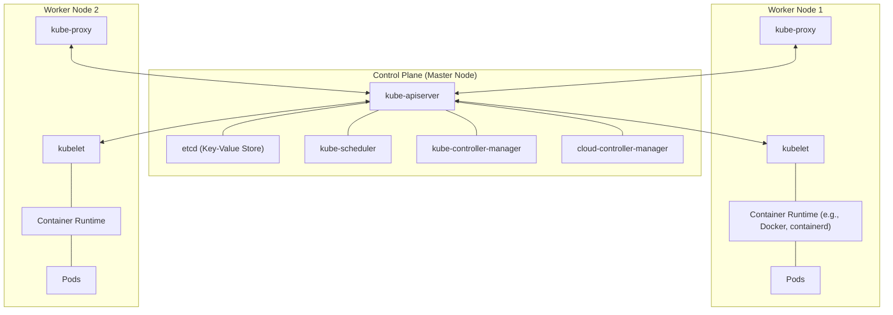

# Kubernetes Architecture Notes

Kubernetes (K8s) is an open-source system for automating deployment, scaling, and management of containerized applications. Understanding its architecture is crucial for mastering it.

## 1. High-Level Architecture Diagram

---

## 2. Control Plane Components
The control plane makes global decisions about the cluster (e.g., scheduling) and detects/responds to cluster events.

### A. kube-apiserver
- **Role:** The front end for the Kubernetes control plane.
- **Function:** It exposes the Kubernetes API. All communication between components happens via the API server. It handles RESTful requests, validates them, and updates objects in `etcd`.

### B. etcd
- **Role:** Consistent and highly-available key-value store.
- **Function:** Stores all cluster data (secrets, config maps, state, etc.). It is the "source of truth" for the cluster.

### C. kube-scheduler
- **Role:** Watches for newly created Pods with no assigned node.
- **Function:** Selects a node for them to run on based on resource requirements, hardware/software constraints, affinity/anti-affinity specifications, etc.

### D. kube-controller-manager
- **Role:** Runs controller processes.
- **Function:** It includes several controllers like:
    - **Node Controller:** Notifies when nodes go down.
    - **Replication Controller:** Maintains the correct number of pods.
    - **Endpoints Controller:** Populates Endpoint objects (joins Services & Pods).
    - **Service Account & Token Controllers:** Create default accounts and API access tokens.

### E. cloud-controller-manager (Optional)
- **Role:** Links your cluster into your cloud provider's API.
- **Function:** Separates the logic that interacts with the cloud platform from the logic that interacts solely with your cluster.

---

## 3. Worker Node Components
Nodes are the machines (VMs or physical servers) where your applications (Pods) actually run.

### A. kubelet
- **Role:** An agent that runs on each node in the cluster.
- **Function:** It ensures that containers are running in a Pod. It takes a set of PodSpecs and ensures that the containers described in those PodSpecs are running and healthy.

### B. kube-proxy
- **Role:** A network proxy that runs on each node.
- **Function:** Maintains network rules on nodes. These rules allow network communication to your Pods from network sessions inside or outside of your cluster.

### C. Container Runtime
- **Role:** The software that is responsible for running containers.
- **Function:** Kubernetes supports several container runtimes: `containerd`, `CRI-O`, and any other implementation of the Kubernetes CRI (Container Runtime Interface).

---

## 4. How it all works together (The Workflow)
1. **User Request:** A user submits a Pod definition (YAML) via `kubectl`.
2. **API Server:** The API Server validates the request and stores it in `etcd`.
3. **Scheduler:** The Scheduler notices the new Pod, decides which Node it should go to, and tells the API Server.
4. **API Server:** Updates the Pod info in `etcd` with the assigned Node.
5. **Kubelet:** The Kubelet on the assigned Node sees the update (via API Server), talks to the **Container Runtime** to pull the image and start the container.
6. **Kube-proxy:** Configures networking so the Pod can communicate.

---

## Interview Questions (Q&A) 🎤

**1. Q: What are the main components of the Kubernetes Control Plane?**
*   **Ans:** API Server, etcd, Scheduler, and Controller Manager. (Together, these four form the 'Brain' of the cluster).

**2. Q: Why is the API Server called the 'Central Hub'?**
*   **Ans:** Because no cluster component (Kubelet, Scheduler, etc.) talks directly to another. Everyone talks to the API Server, and the API Server passes the information along.

**3. Q: What happens if `etcd` goes down?**
*   **Ans:** The Kubernetes cluster will stop working because etcd is the cluster's 'Database'. If the state is not stored, K8s won't know which pod is running where. Therefore, backup and high availability for etcd are crucial in production.

**4. Q: What is the selection logic of the Scheduler?**
*   **Ans:** The Scheduler uses two steps: **Filtering** (which nodes can run the pod) and **Scoring** (which of those nodes is the best choice based on resources).

**5. Q: What is the role of the Cloud Controller Manager (CCM)?**
*   **Ans:** It handles cloud-specific logic (like creating Load Balancers or attaching Storage volumes in AWS/Azure). This keeps Kubernetes core code independent of the cloud provider.

**6. Q: How do you make the K8s Control Plane Highly Available (HA)?**
*   **Ans:** We run 3 or 5 Master Nodes, create an etcd cluster, and place a Load Balancer in front of the API Server so that if one master node fails, the cluster continues to function.

**7. Q: How does the API Server validate a request?**
*   **Ans:** There are three steps: **Authentication** (Who is it?), **Authorization** (Can they do this?), and **Admission Control** (Is the request valid according to policy?).

**8. Q: How is communication between the Control Plane and Worker Nodes secured?**
*   **Ans:** All communication is encrypted using **TLS (mTLS)** certificates. Each component has its own certificate.

**9. Q: What does "Immutable Infrastructure" mean in the context of K8s architecture?**
*   **Ans:** It means we don't make changes to a running server. If something needs to change, we create a new Pod or Node and replace the old one.

**10. Q: What is the "Container Runtime Interface (CRI)" in K8s?**
*   **Ans:** It is a plugin interface that allows Kubelet to communicate with different container runtimes (like containerd, CRI-O, Docker) without changing Kubelet's code.
