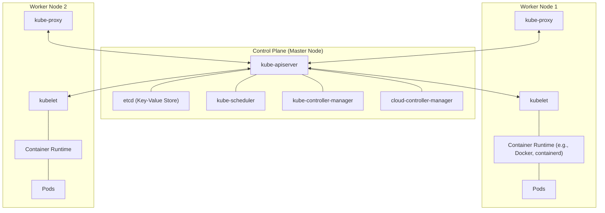

# Kubernetes Architecture Notes

Kubernetes (K8s) is an open-source system for automating deployment, scaling, and management of containerized applications. Understanding its architecture is crucial for mastering it.

## 1. High-Level Architecture Diagram

---

## 2. Control Plane Components
The control plane makes global decisions about the cluster (e.g., scheduling) and detects/responds to cluster events.

### A. kube-apiserver
- **Role:** The front end for the Kubernetes control plane.
- **Function:** It exposes the Kubernetes API. All communication between components happens via the API server. It handles RESTful requests, validates them, and updates objects in `etcd`.

### B. etcd
- **Role:** Consistent and highly-available key-value store.
- **Function:** Stores all cluster data (secrets, config maps, state, etc.). It is the "source of truth" for the cluster.

### C. kube-scheduler
- **Role:** Watches for newly created Pods with no assigned node.
- **Function:** Selects a node for them to run on based on resource requirements, hardware/software constraints, affinity/anti-affinity specifications, etc.

### D. kube-controller-manager
- **Role:** Runs controller processes.
- **Function:** It includes several controllers like:
    - **Node Controller:** Notifies when nodes go down.
    - **Replication Controller:** Maintains the correct number of pods.
    - **Endpoints Controller:** Populates Endpoint objects (joins Services & Pods).
    - **Service Account & Token Controllers:** Create default accounts and API access tokens.

### E. cloud-controller-manager (Optional)
- **Role:** Links your cluster into your cloud provider's API.
- **Function:** Separates the logic that interacts with the cloud platform from the logic that interacts solely with your cluster.

---

## 3. Worker Node Components
Nodes are the machines (VMs or physical servers) where your applications (Pods) actually run.

### A. kubelet
- **Role:** An agent that runs on each node in the cluster.
- **Function:** It ensures that containers are running in a Pod. It takes a set of PodSpecs and ensures that the containers described in those PodSpecs are running and healthy.

### B. kube-proxy
- **Role:** A network proxy that runs on each node.
- **Function:** Maintains network rules on nodes. These rules allow network communication to your Pods from network sessions inside or outside of your cluster.

### C. Container Runtime
- **Role:** The software that is responsible for running containers.
- **Function:** Kubernetes supports several container runtimes: `containerd`, `CRI-O`, and any other implementation of the Kubernetes CRI (Container Runtime Interface).

---

## 4. How it all works together (The Workflow)
1. **User Request:** A user submits a Pod definition (YAML) via `kubectl`.
2. **API Server:** The API Server validates the request and stores it in `etcd`.
3. **Scheduler:** The Scheduler notices the new Pod, decides which Node it should go to, and tells the API Server.
4. **API Server:** Updates the Pod info in `etcd` with the assigned Node.
5. **Kubelet:** The Kubelet on the assigned Node sees the update (via API Server), talks to the **Container Runtime** to pull the image and start the container.
6. **Kube-proxy:** Configures networking so the Pod can communicate.

---

## Interview Questions (Q&A) 🎤

**1. Q: Kubernetes Control Plane ke main components kya hain?**
*   **Ans:** API Server, etcd, Scheduler, aur Controller Manager. (Ye charo milkar cluster ka 'Brain' bante hain).

**2. Q: API Server ko 'Central Hub' kyu kehte hain?**
*   **Ans:** Kyunki cluster ka koi bhi component (Kubelet, Scheduler, etc.) direct ek dusre se baat nahi karta. Sab API Server se baat karte hain aur API Server hi aage information pass karta hai.

**3. Q: Agar `etcd` down ho jaye toh kya hoga?**
*   **Ans:** Kubernetes cluster kaam karna band kar dega kyunki etcd cluster ka 'Database' hai. Agar state store nahi hoga, toh K8s ko pata hi nahi chalega ki kaun sa pod kahan chal raha hai. Isliye production me etcd ka backup aur high availability bahut zaroori hai.

**4. Q: Scheduler ka selection logic kya hota hai?**
*   **Ans:** Scheduler do steps use karta hai: **Filtering** (kaun se nodes pod ko chala sakte hain) aur **Scoring** (un nodes me se sabse best kaun hai based on resources).

**5. Q: Cloud Controller Manager (CCM) ka kya kaam hai?**
*   **Ans:** Ye cloud-specific logic ko handle karta hai (jaise AWS/Azure me Load Balancer banana ya Storage volumes attach karna). Isse Kubernetes core code cloud-provider se alag rehta hai.

**6. Q: K8s Control Plane ko High Availability (HA) kaise banate hain?**
*   **Ans:** Hum 3 ya 5 Master Nodes chalate hain. etcd ka cluster banate hain aur API Server ke aage ek Load Balancer laga dete hain taaki agar ek master node gire, toh cluster chalta rahe.

**7. Q: API Server request ko validate kaise karta hai?**
*   **Ans:** Teen steps hote hain: **Authentication** (Kaun hai?), **Authorization** (Kya wo ye kar sakta hai?), aur **Admission Control** (Kya request policy ke hisaab se sahi hai?).

**8. Q: Control Plane aur Worker Nodes ke beech communication secure kaise hota hai?**
*   **Ans:** Poora communication **TLS (mTLS)** certificates se encrypted hota hai. Har component ke paas apna certificate hota hai.

**9. Q: "Immutable Infrastructure" ka K8s architecture me kya matlab hai?**
*   **Ans:** Iska matlab hai ki hum chalte hue server me changes nahi karte. Agar kuch badalna hai, toh hum naya Pod ya Node banate hain aur purane ko hata dete hain.

**10. Q: K8s me "Container Runtime Interface (CRI)" kya hai?**
*   **Ans:** Ye ek plugin interface hai jo Kubelet ko alag-alag container runtimes (jaise containerd, CRI-O, Docker) ke saath baat karne ki ijazat deta hai bina Kubelet ka code badle.

